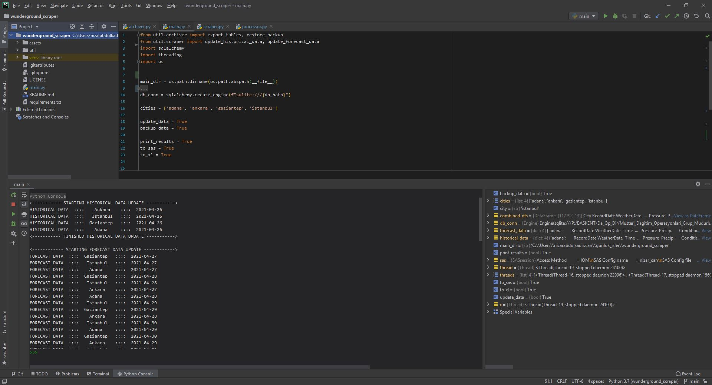

# WUnderground Scraper

This tool has been created for educational purposes as a challenge. The code in this repository
scrapes both historical weather data and the weather forecasts from wunderground.com and stores it within a sqlite3 database file.
The tool also has the functions to format the scraped data and export the formatted data to an Excel file or to a SAS server.

